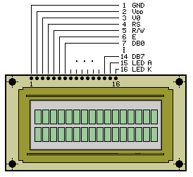
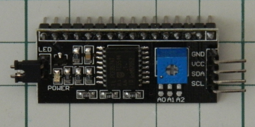

# lcd-scripts

Is a set of bash scripts to control (via RaspberryPi's GPIO) a 16x2  LCD display
managed by an HD44780 controller via interfaced via the I2C bus.

## Display

The device is a LCD QC1602A v2.0
([datasheet](https://www.sparkfun.com/datasheets/LCD/HD44780.pdf)). The display
has 16 control pins as shown below.

01. **VSS**: GND
02. **VDD**: +Vcc
03. **V0**:  contrast setting
04. **RS**:  register select (0 - commands, 1 - data)
05. **RW**:  read (1) or write (0)
06. **E**:   enable (falling edge triggered)
07. **DB0**: data pin 0
08. **DB1**: data pin 1
09. **DB2**: data pin 2
10. **DB3**: data pin 3
11. **DB4**: data pin 4
12. **DB5**: data pin 5
13. **DB6**: data pin 6
14. **DB7**: data pin 7
15. **A**:   backlight anode
16. **K**:   backlight cathode

## I2C adapter

To be able to control the display via I2C the following IC has been used

The adapter uses an 8 bit PCF8574T I/O-expander
([datasheet](http://www.nxp.com/documents/data_sheet/PCF8574.pdf)) **`0x27`** 
is the deault I2C adress. The 8 bits available are mapped as
follows:

PC8574T bus pin | LCD QC1602A pin
:--------------:|:---------------:
P0              |RS
P1              |RW
P2              |E
P3              |BlackLight
P4              |DB4
P5              |DB5
P6              |DB6
P7              |DB7

Since only the 4 most significant bits are used on the data bus of the display
the communication is performed in nibbles instead of bytes.

## Use the display with the terminal
###Note that
- All the scripts assume the device is set to the default I2C address
**`0x27`** and the pins has been mapped as shown above.

- All the scripts use the `I2C_BUS` environment variable to access the right
I2C bus. Set the variable accordingly to your setup before you run
the scripts. Common values are `0` or `1`.

- The scripts make use of the **`i2cset`** tool, make sure it's installed on your
system

- Before sending commands to the display the communication format needs to be set
to nibble using the **lcd-function-set.sh** script.
 
- The **lcd-set-ddram-addr.sh** make use of the `bc` tool, make sure it's installed
on your system
 
- The **lcdTool-print.sh** tool make use of the`hexdump` command, make sure it's 
installed on your system 

### The Scripts
Were designed to make the instructions described in the 
[datasheet](http://www.nxp.com/documents/data_sheet/PCF8574.pdf) available to the end user
(pages 24-25).

- **lcd-function-set.sh**: sends `function set` instruction to the display
allowing to select the number of lines and characters format.
Sets the display in  nibble communication. Can be used only one time until
the display is reset.
 
- **lcd-entry-mode.sh**: sends `entry mode set` instruction allowing to specify
how the cursor and display should behave every time a character is written on the display.
Cursor can be set to move to right or left. Display can be set to "shift" or not.
 
- **lcd-display-ctrl.sh**: sends the `display control` instruction allowing to 
set the display on and off, the cursor on and off and whether the cursor should blink
or not. It is still possible to send characters to the display when it's in the off state,
they will be shown when it is turned back on.
It is also possible to write characters when the cursor is off
 
- **lcd-clear.sh**: sends the `clear` instruction to clear the content of the
display and move the cursor back to the initiali position
 
- **lcd-return-home.sh**: sends the `return home` instruction which moves
the cursor and the display back to the initial position. the content of the display is
not altered.
 
- **lcd-cursor-display-shift.sh**: sends the `display or cursor shift` instruction
with the effect of moving the cursor and the display one position either to the left
or to the right .
 
- **lcd-backlight.sh**: sets the backlighting on or off.
 
- **lcd-set-ddram-addr.sh**: sends the `set DDRAM address` instruciotn allowing to
move the cursor *randomly* across the display. Every cursor position has a specific address.
The addresses change if the display is set to operate on one or two rows:
  - *1 Row*: **80** positions are available with addresses ranging from **0x00** to **0x4F**.
  - *2 Rows*: **40** positions per row are available with addresses ranging:
    - *row 1*: from **0x00** to **0x27**
    - *row 2*: from **0x40** to **0x67**
    
   
  Every row is like a "circular buffer", last position's address is also the one 
  before the first.
  
- **lcd-write-data.sh**: sends `Write data to CG or DDRAM` instruction 
with the effect of writing a character on the display at the current position
of the cursor. Allowed values are those of the UTF-8 encoding except the non printable
ones (control characters)  that are remapped on special characters (see pages 17-18 of the
[datasheet](http://www.nxp.com/documents/data_sheet/PCF8574.pdf)).
 
- **lcd-set-cgram-addr.sh**: sends the `set CGRAM address` instrucions
wich has the effect of moving the cursor to the section of the memory reserved to define 
personalized characters.
The data sent afterwards is interpreted as the new character pattern.
To get back to writing characters on the display the cursor has to be moved back to a DDRAM
address.
The address given as argument does not specify the location of the first character stored,
instead it it used as the first location of the first row of the pattern that makes up the
character.
Up to 8 personalized characters can be set, that gives 64 addresses, one for each row that produce
each character (from 0x00 to 0x3F). More information at page 19 of the
[datasheet](http://www.nxp.com/documents/data_sheet/PCF8574.pdf)).

###Tools
Some tools have been developed to ease some operation on the display:

- **lcdTool-print.sh**: allows to write on the display the sentence given as argument.
The string has to be specified within double quotes (" ") and is written on the display 
stasrting at the current position of the cursor
 
- **lcdTool-set-custom-char.sh**: allows to send a custom character character to the display.
The pattern is made of 8 rows of 0s and 1s, 5 characters each:
0 specifies pixel off, 1 pixel on. Tha pattern can be given as standard input or read from file.
The character will be stored in one of the available DDRAM addresses (from 0x00 to 0x07).
